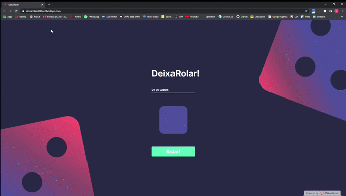

# 🎲 DeixaRolar

## ℹ️ Sobre
Desenvolvido com intuito de pôr em prática meus estudos recentes em JavaScript, HTML e CSS.

Um site de emulação de rolagem de dados voltado para partidas de RPG.

## ✅ Funcionalidades

- [x] Animação do dado ao rolar
- [x] Responsividade
- [x] Mensagens de alerta ao tentar rodar um dado com numero de lados maior que 100 ou menor que 2

## ⏩ Resultado
https://deixarolar.000webhostapp.com/
<h1>
    
</h1>

## 👨‍💻 Participantes

<table>
<td align="center"><a href="https://github.com/LuanAccioly"> <b>Luan Accioly</b></a> </td>

<td align="center"><a href="https://github.com/Rodrigo-Tibirica"> <b>Rodrigo Azevedo</b></a> </td>
</table>